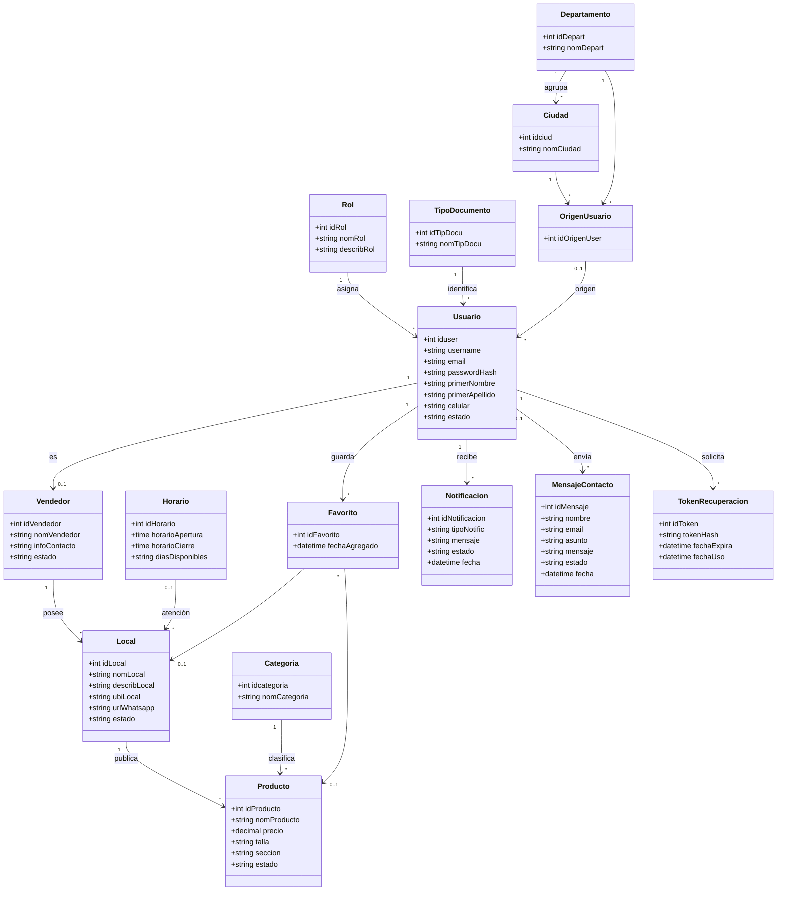

# Diagrama de clases del dominio

Basado en las *clases candidatas* del documento funcional (sección 2.3) y en el modelo de datos. Los atributos reflejan `database/galezarzalBD.sql`.

```mermaid
classDiagram
    class Rol {
        +int idRol
        +string nomRol
        +string describRol
    }
    class TipoDocumento {
        +int idTipDocu
        +string nomTipDocu
    }
    class Departamento {
        +int idDepart
        +string nomDepart
    }
    class Ciudad {
        +int idciud
        +string nomCiudad
    }
    class OrigenUsuario {
        +int idOrigenUser
    }
    class Usuario {
        +int iduser
        +string username
        +string email
        +string passwordHash
        +string primerNombre
        +string primerApellido
        +string celular
        +string estado
    }
    class Vendedor {
        +int idVendedor
        +string nomVendedor
        +string infoContacto
        +string estado
    }
    class Horario {
        +int idHorario
        +time horarioApertura
        +time horarioCierre
        +string diasDisponibles
    }
    class Local {
        +int idLocal
        +string nomLocal
        +string describLocal
        +string ubiLocal
        +string urlWhatsapp
        +string estado
    }
    class Categoria {
        +int idcategoria
        +string nomCategoria
    }
    class Producto {
        +int idProducto
        +string nomProducto
        +decimal precio
        +string talla
        +string seccion
        +string estado
    }
    class Favorito {
        +int idFavorito
        +datetime fechaAgregado
    }
    class Notificacion {
        +int idNotificacion
        +string tipoNotific
        +string mensaje
        +string estado
        +datetime fecha
    }

    class MensajeContacto {
        +int idMensaje
        +string nombre
        +string email
        +string asunto
        +string mensaje
        +string estado
        +datetime fecha
    }
    class TokenRecuperacion {
        +int idToken
        +string tokenHash
        +datetime fechaExpira
        +datetime fechaUso
    }

    Rol "1" --> "*" Usuario : asigna
    TipoDocumento "1" --> "*" Usuario : identifica
    OrigenUsuario "0..1" --> "*" Usuario : origen
    Departamento "1" --> "*" Ciudad : agrupa
    Ciudad "1" --> "*" OrigenUsuario
    Departamento "1" --> "*" OrigenUsuario
    Usuario "1" --> "0..1" Vendedor : es
    Vendedor "1" --> "*" Local : posee
    Horario "0..1" --> "*" Local : atención
    Local "1" --> "*" Producto : publica
    Categoria "1" --> "*" Producto : clasifica
    Usuario "1" --> "*" Favorito : guarda
    Favorito "*" --> "0..1" Local
    Favorito "*" --> "0..1" Producto
    Usuario "1" --> "*" Notificacion : recibe
    Usuario "0..1" --> "*" MensajeContacto : envía
    Usuario "1" --> "*" TokenRecuperacion : solicita
```
