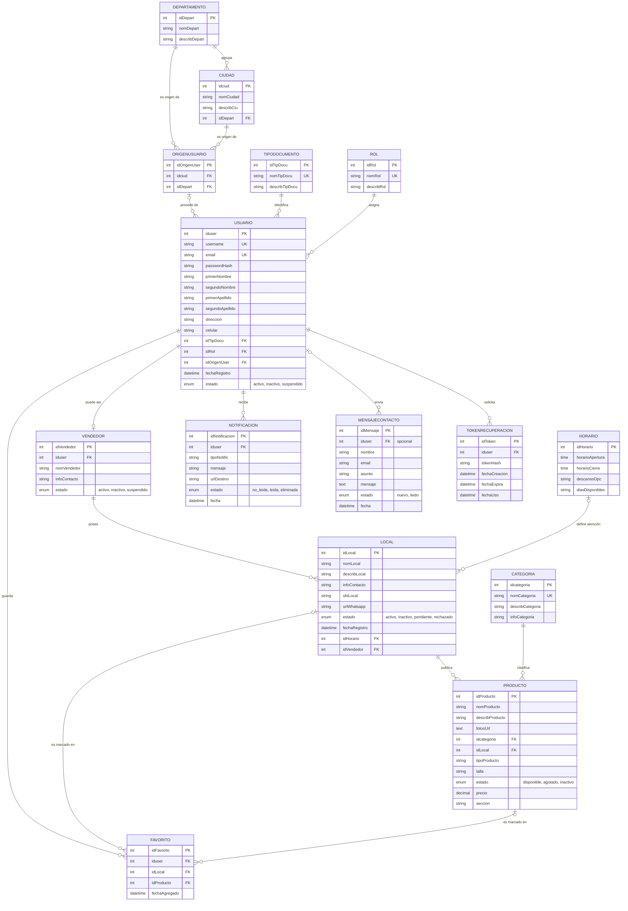

# Modelo entidad-relación

Fuente: `database/galezarzalBD.sql`. Si la base de datos cambia, actualiza este diagrama **y** el SQL en el mismo PR.

```mermaid
erDiagram
    DEPARTAMENTO ||--o{ CIUDAD : "agrupa"
    DEPARTAMENTO ||--o{ ORIGENUSUARIO : "es origen de"
    CIUDAD ||--o{ ORIGENUSUARIO : "es origen de"
    ORIGENUSUARIO |o--o{ USUARIO : "procede de"
    TIPODOCUMENTO ||--o{ USUARIO : "identifica"
    ROL ||--o{ USUARIO : "asigna"
    USUARIO ||--o| VENDEDOR : "puede ser"
    VENDEDOR ||--o{ LOCAL : "posee"
    HORARIO |o--o{ LOCAL : "define atención"
    LOCAL ||--o{ PRODUCTO : "publica"
    CATEGORIA ||--o{ PRODUCTO : "clasifica"
    USUARIO ||--o{ FAVORITO : "guarda"
    LOCAL |o--o{ FAVORITO : "es marcado en"
    PRODUCTO |o--o{ FAVORITO : "es marcado en"
    USUARIO ||--o{ NOTIFICACION : "recibe"
    USUARIO |o--o{ MENSAJECONTACTO : "envía"
    USUARIO ||--o{ TOKENRECUPERACION : "solicita"

    DEPARTAMENTO {
        int idDepart PK
        string nomDepart
        string describDepart
    }
    CIUDAD {
        int idciud PK
        string nomCiudad
        string describCiu
        int idDepart FK
    }
    ORIGENUSUARIO {
        int idOrigenUser PK
        int idciud FK
        int idDepart FK
    }
    TIPODOCUMENTO {
        int idTipDocu PK
        string nomTipDocu UK
        string describTipDocu
    }
    ROL {
        int idRol PK
        string nomRol UK
        string describRol
    }
    USUARIO {
        int iduser PK
        string username UK
        string email UK
        string passwordHash
        string primerNombre
        string segundoNombre
        string primerApellido
        string segundoApellido
        string direccion
        string celular
        int idTipDocu FK
        int idRol FK
        int idOrigenUser FK
        datetime fechaRegistro
        enum estado "activo, inactivo, suspendido"
    }
    VENDEDOR {
        int idVendedor PK
        int iduser FK
        string nomVendedor
        string infoContacto
        enum estado "activo, inactivo, suspendido"
    }
    HORARIO {
        int idHorario PK
        time horarioApertura
        time horarioCierre
        string descansoOpc
        string diasDisponibles
    }
    LOCAL {
        int idLocal PK
        string nomLocal
        string describLocal
        string infoContacto
        string ubiLocal
        string urlWhatsapp
        enum estado "activo, inactivo, pendiente, rechazado"
        datetime fechaRegistro
        int idHorario FK
        int idVendedor FK
    }
    CATEGORIA {
        int idcategoria PK
        string nomCategoria UK
        string describCategoria
        string infoCategoria
    }
    PRODUCTO {
        int idProducto PK
        string nomProducto
        string describProducto
        text fotosUrl
        int idcategoria FK
        int idLocal FK
        string tipoProducto
        string talla
        enum estado "disponible, agotado, inactivo"
        decimal precio
        string seccion
    }
    FAVORITO {
        int idFavorito PK
        int iduser FK
        int idLocal FK
        int idProducto FK
        datetime fechaAgregado
    }
    MENSAJECONTACTO {
        int idMensaje PK
        int iduser FK "opcional"
        string nombre
        string email
        string asunto
        text mensaje
        enum estado "nuevo, leido"
        datetime fecha
    }
    TOKENRECUPERACION {
        int idToken PK
        int iduser FK
        string tokenHash
        datetime fechaCreacion
        datetime fechaExpira
        datetime fechaUso
    }
    NOTIFICACION {
        int idNotificacion PK
        int iduser FK
        string tipoNotific
        string mensaje
        string urlDestino
        enum estado "no_leida, leida, eliminada"
        datetime fecha
    }
```
