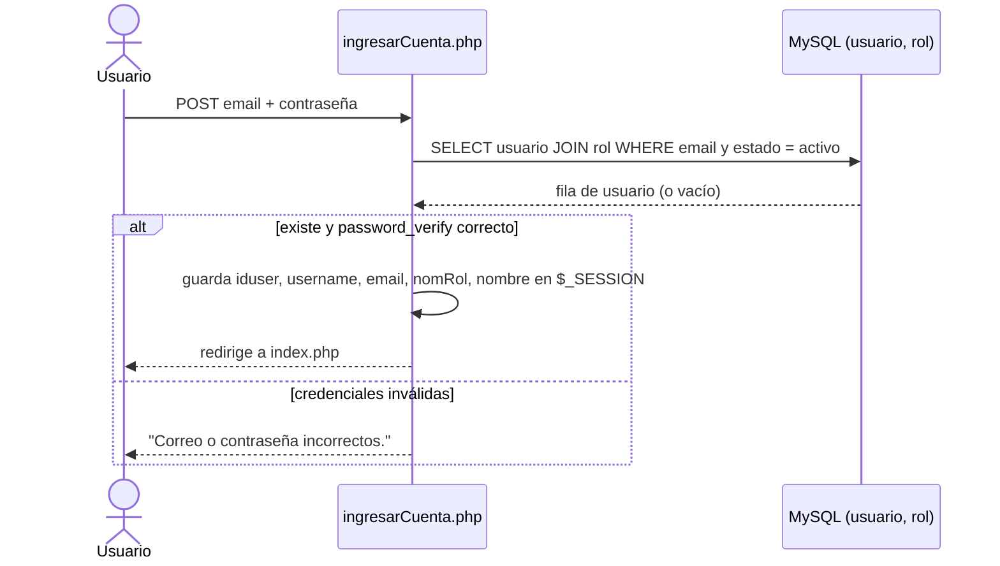
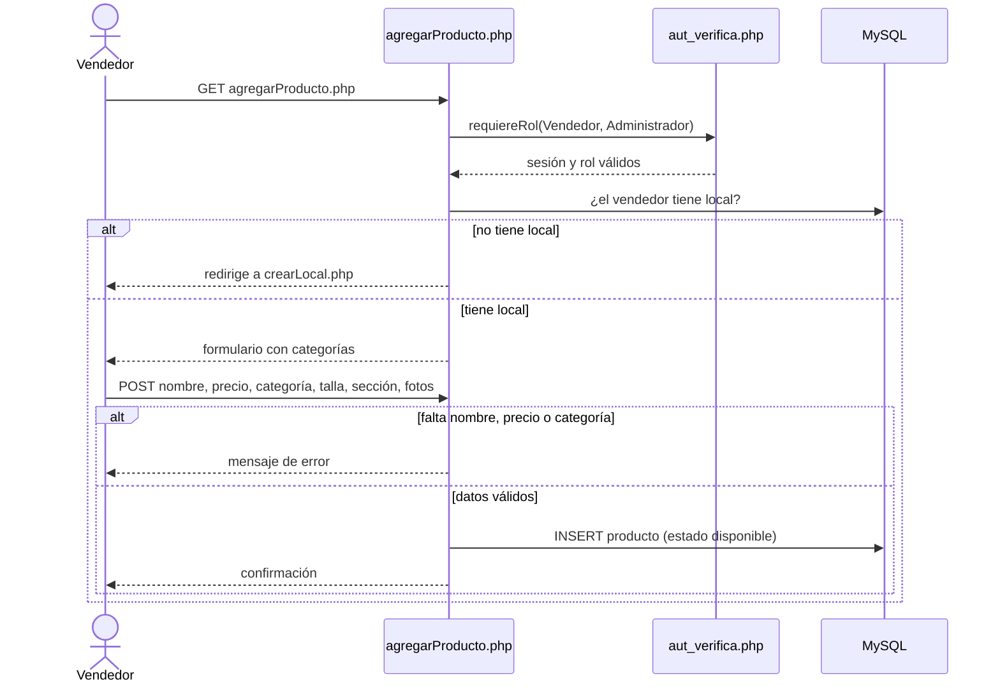

# Diagramas de secuencia

## Iniciar sesión (RF-03): `usuario/ingresarCuenta.php`

```mermaid
sequenceDiagram
    actor U as Usuario
    participant P as ingresarCuenta.php
    participant DB as MySQL (usuario, rol)

    U->>P: POST email + contraseña
    P->>DB: SELECT usuario JOIN rol WHERE email y estado = activo
    DB-->>P: fila de usuario (o vacío)
    alt existe y password_verify correcto
        P->>P: guarda iduser, username, email, nomRol, nombre en $_SESSION
        P-->>U: redirige a index.php
    else credenciales inválidas
        P-->>U: "Correo o contraseña incorrectos."
    end
```

## Agregar producto (RF-10): `catalogo/agregarProducto.php`

```mermaid
sequenceDiagram
    actor V as Vendedor
    participant P as agregarProducto.php
    participant A as aut_verifica.php
    participant DB as MySQL

    V->>P: GET agregarProducto.php
    P->>A: requiereRol(Vendedor, Administrador)
    A-->>P: sesión y rol válidos
    P->>DB: ¿el vendedor tiene local?
    alt no tiene local
        P-->>V: redirige a crearLocal.php
    else tiene local
        P-->>V: formulario con categorías
        V->>P: POST nombre, precio, categoría, talla, sección, fotos
        alt falta nombre, precio o categoría
            P-->>V: mensaje de error
        else datos válidos
            P->>DB: INSERT producto (estado disponible)
            P-->>V: confirmación
        end
    end
```
